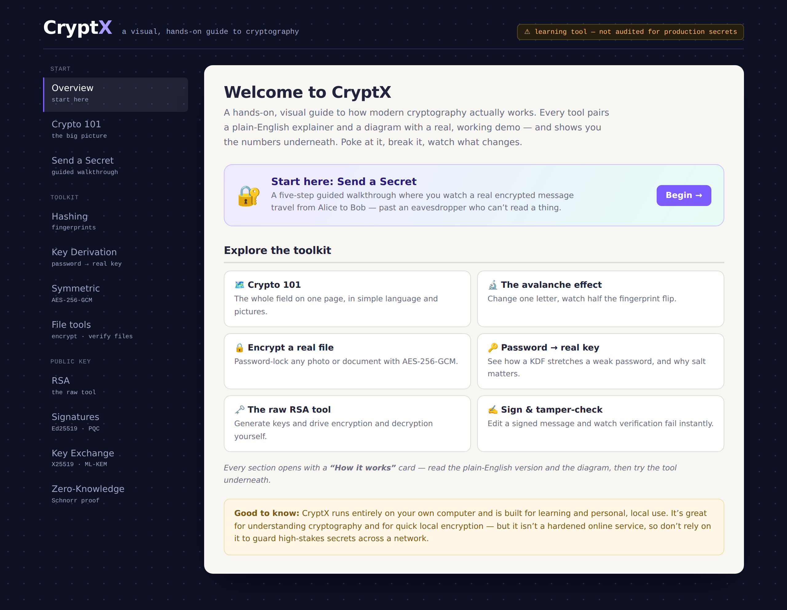
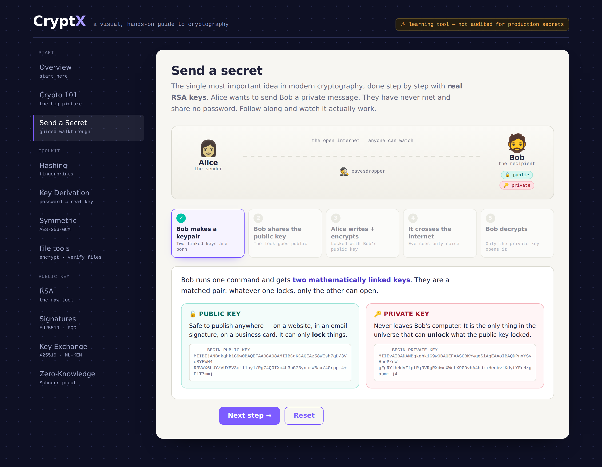
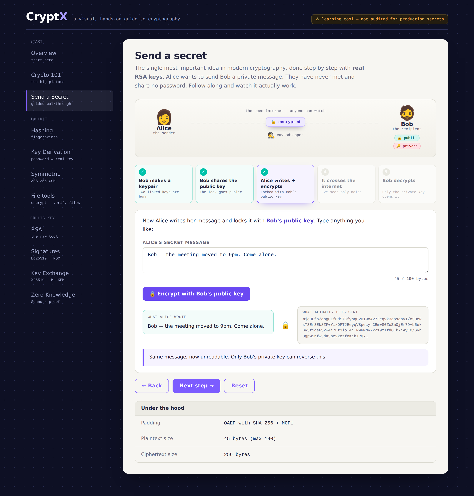
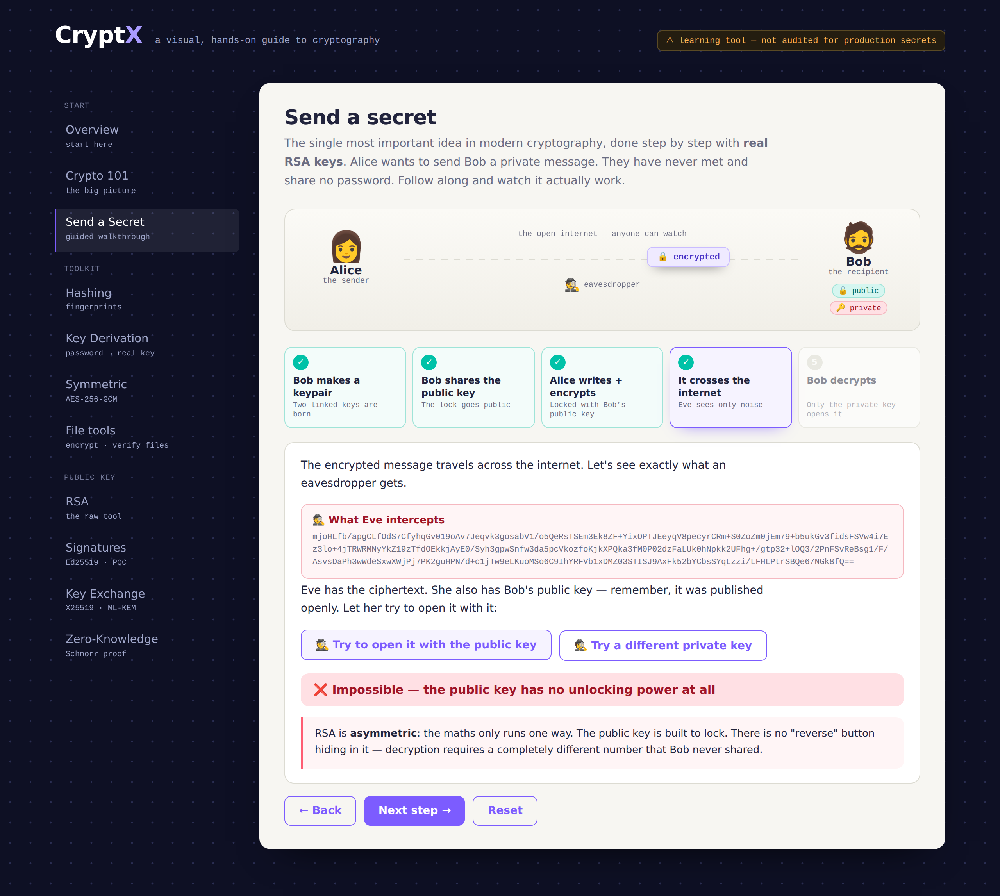
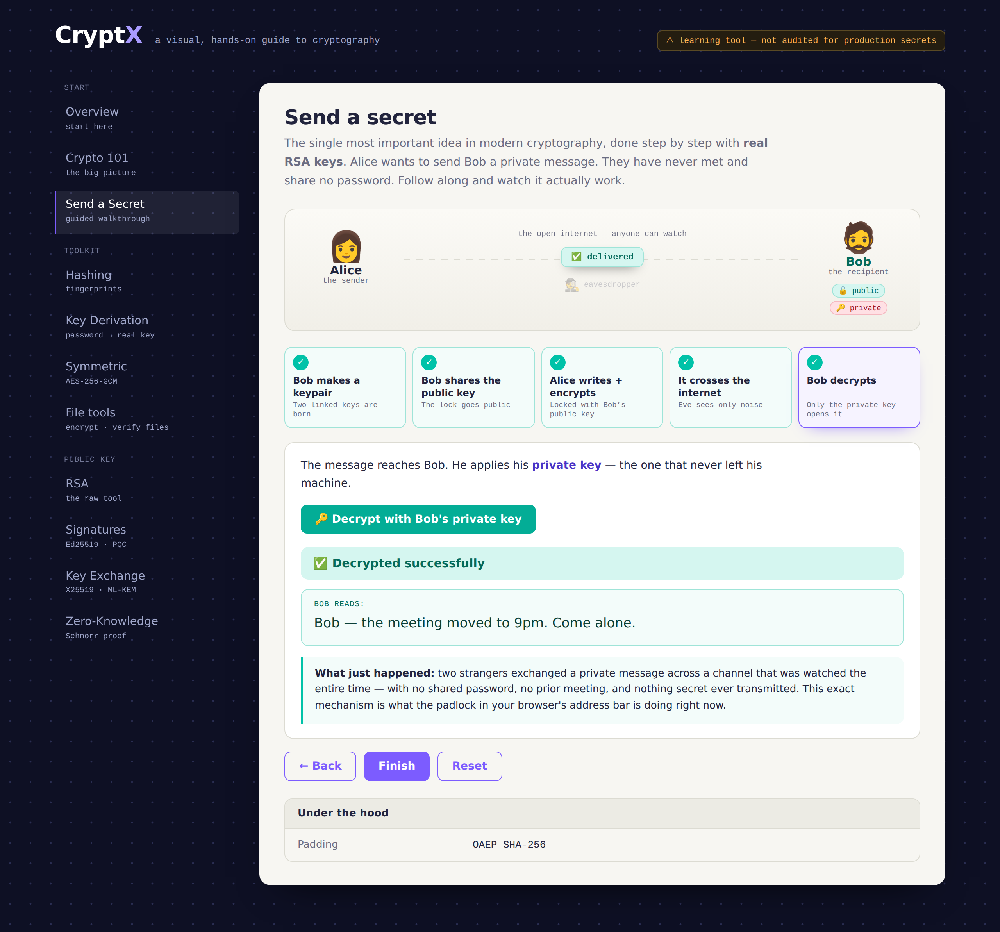
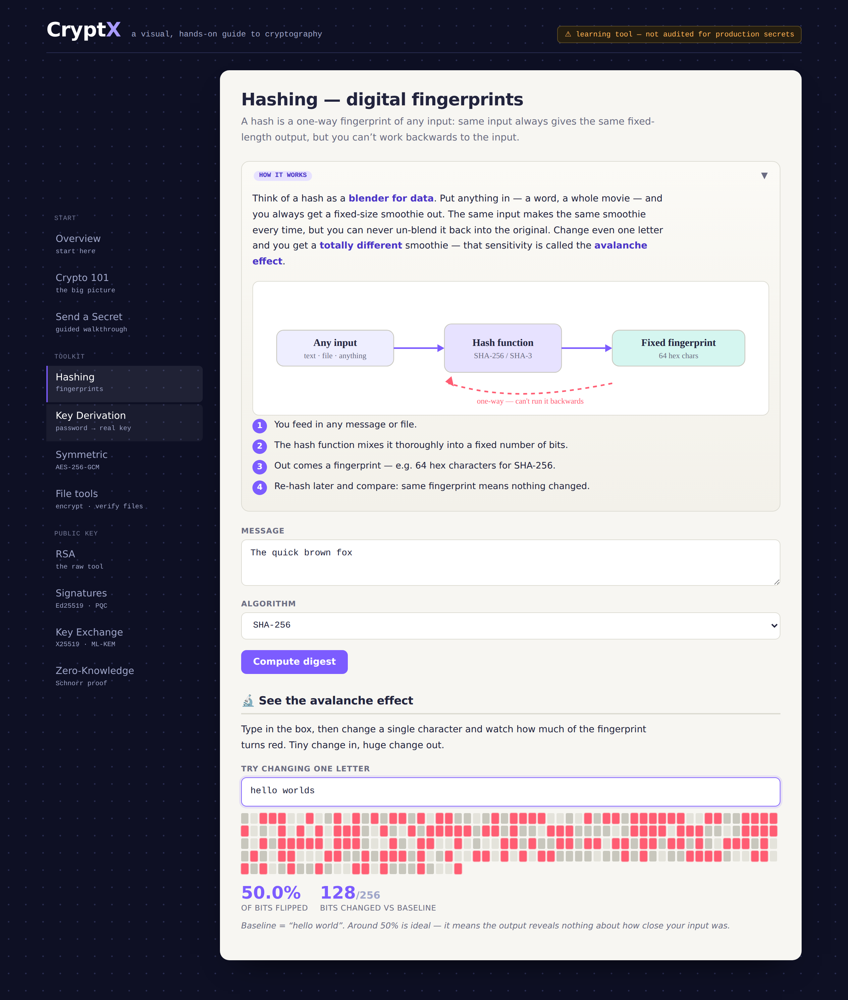

# CryptX

A visual, hands-on guide to cryptography. It runs in your browser, on your own machine, and shows the working behind every result instead of just printing an answer.



## Why

Most people use encryption every day without ever seeing what it does. CryptX pairs each tool with a plain-English explanation and a diagram, then lets you run the real algorithm and inspect the numbers underneath.

## Send a Secret

The centrepiece is a five-step walkthrough. Alice wants to message Bob. They have never met, share no password, and someone is watching the wire the whole time.

Bob generates a real 2048-bit RSA keypair, and the two keys are shown for what they are: one safe to publish anywhere, one that never leaves his machine.



Alice writes a message and locks it with Bob's public key. You see the plaintext and the ciphertext side by side.



Then you play the eavesdropper. You can try opening the message with the public key, and you can generate your own valid RSA private key and try that. Both fail, and the app explains why.



Bob's private key opens it in one click.



## What else is in it

Hashing with SHA-2, SHA-3 and BLAKE2, including an avalanche visualiser that shows roughly half the output bits flipping when you change a single character of input.



Key derivation with Argon2id, PBKDF2 and HKDF. Symmetric encryption with AES-256-GCM. File encryption and checksum verification. Digital signatures with Ed25519, ECDSA-P256, RSA-PSS and post-quantum ML-DSA. Key exchange with X25519, ML-KEM-768 and a hybrid of both. A Schnorr zero-knowledge proof, with a toggle to simulate a cheating prover and watch verification reject it.

## Running it

You need Python 3.9 or newer.

```
pip install -r requirements.txt
python cryptx_app.py
```

It opens `http://127.0.0.1:5000` automatically. On Windows you can double-click `START_CryptX.bat`, which installs the dependencies on first run.

Everything happens locally. Nothing is uploaded and nothing is stored between runs. The one external request is a Google Fonts stylesheet; without internet the app still works and falls back to system fonts.

## How it is built

One Python file. Flask serves a JSON API and a single-page interface; the front end is vanilla JavaScript with inline SVG, so there is no build step and no npm.

The cryptography comes from audited libraries: `cryptography` for AES-GCM, RSA, Ed25519, ECDSA and X25519, `argon2-cffi` for Argon2id, `kyber-py` for ML-KEM and `dilithium-py` for ML-DSA. Only the Schnorr proof and the hybrid key-exchange combiner are written here, and both are standard constructions you can read in the source.

## A note on scope

This is a learning tool. It uses real algorithms correctly, but it has not been audited, it has no authentication, and it is meant to run on localhost. Use it to understand cryptography and for casual local encryption. Do not use it to protect anything that would genuinely hurt you to lose.

## Licence

MIT. See [LICENSE](LICENSE).
